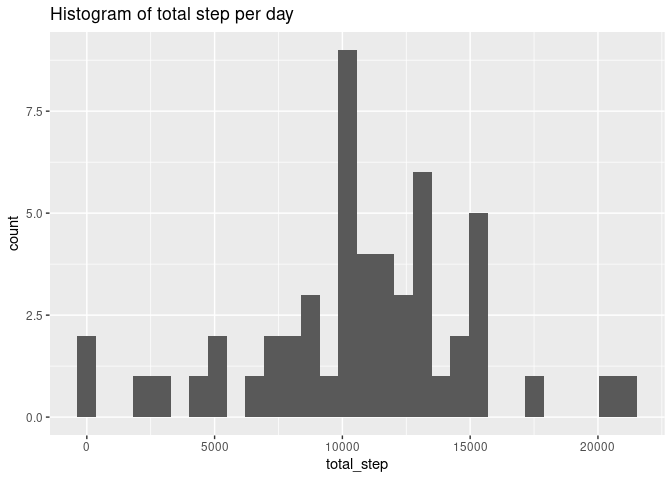
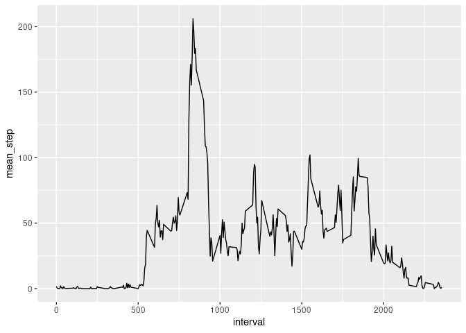
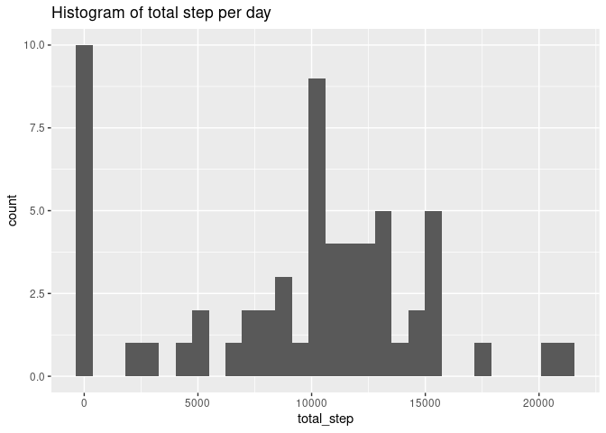
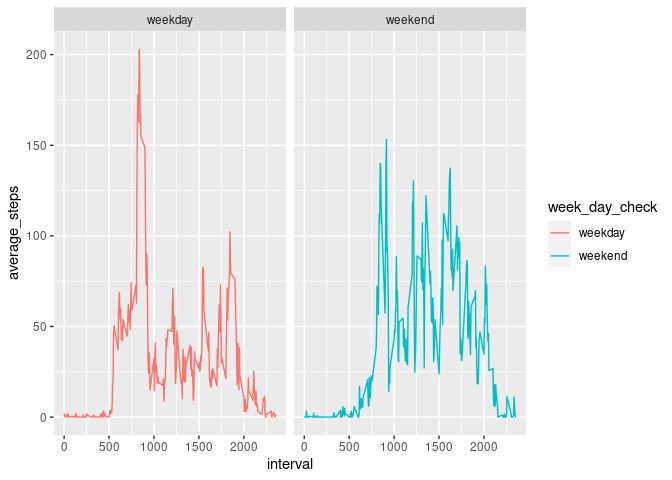

1. Loading and preprocessing the data
-------------------------------------

    library(data.table)
    library(tidyverse)

    ## ── Attaching packages ─────────────────────────────────────── tidyverse 1.3.0 ──

    ## ✓ ggplot2 3.3.2     ✓ purrr   0.3.4
    ## ✓ tibble  3.0.4     ✓ dplyr   1.0.2
    ## ✓ tidyr   1.1.2     ✓ stringr 1.4.0
    ## ✓ readr   1.4.0     ✓ forcats 0.5.0

    ## ── Conflicts ────────────────────────────────────────── tidyverse_conflicts() ──
    ## x dplyr::between()   masks data.table::between()
    ## x dplyr::filter()    masks stats::filter()
    ## x dplyr::first()     masks data.table::first()
    ## x dplyr::lag()       masks stats::lag()
    ## x dplyr::last()      masks data.table::last()
    ## x purrr::transpose() masks data.table::transpose()

    path <- "/media/ad/01D6B57CFBE4DB20/1.Linux/Data/JHU data/activity.csv"
    data <- fread(path)
    head(data)

    ##    steps       date interval
    ## 1:    NA 2012-10-01        0
    ## 2:    NA 2012-10-01        5
    ## 3:    NA 2012-10-01       10
    ## 4:    NA 2012-10-01       15
    ## 5:    NA 2012-10-01       20
    ## 6:    NA 2012-10-01       25

    tail(data)

    ##    steps       date interval
    ## 1:    NA 2012-11-30     2330
    ## 2:    NA 2012-11-30     2335
    ## 3:    NA 2012-11-30     2340
    ## 4:    NA 2012-11-30     2345
    ## 5:    NA 2012-11-30     2350
    ## 6:    NA 2012-11-30     2355

The variables included in this dataset are:

-   steps: Number of steps taking in a 5-minute interval (missing values
    are coded as NA)
-   date: The date on which the measurement was taken in YYYY-MM-DD
    format
-   interval: Identifier for the 5-minute interval in which measurement
    was taken

2. Data exclude NA value
------------------------

### 2.1 What is mean total number of steps taken per da

For this part of the assignment, you can ignore the missing values in
the dataset.

    dim(data)

    ## [1] 17568     3

    sum(is.na(data))

    ## [1] 2304

    null_value <- sapply(data, function(x) sum(is.na(x)))
    null_value

    ##    steps     date interval 
    ##     2304        0        0

    data_exclude_na <- na.omit(data)
    dim(data_exclude_na)

    ## [1] 15264     3

    step_per_day <- data_exclude_na[,.(total_step = sum(steps)),by=date]
    head(step_per_day)

    ##          date total_step
    ## 1: 2012-10-02        126
    ## 2: 2012-10-03      11352
    ## 3: 2012-10-04      12116
    ## 4: 2012-10-05      13294
    ## 5: 2012-10-06      15420
    ## 6: 2012-10-07      11015

    #png("plot1.png", width=480, height=480)
    step_per_day %>% 
      ggplot(aes(x=total_step))+
      geom_histogram() +
      labs(title = "Histogram of total step per day")

    ## `stat_bin()` using `bins = 30`. Pick better value with `binwidth`.

    # Method 1: mean and median by data.table function
    step_per_day[,c(lapply(.SD,median),lapply(.SD,mean)), .SDcols="total_step"]

    ##    total_step total_step
    ## 1:      10765   10766.19

    # Method 2: mean and median by summary function
    summary(step_per_day$total_step) 

    ##    Min. 1st Qu.  Median    Mean 3rd Qu.    Max. 
    ##      41    8841   10765   10766   13294   21194

    # median: 10765 , mean: 10766

### 2.2 What is the average daily activity pattern?

Make a time series plot (i.e. type = “l”) of the 5-minute interval
(x-axis) and the average number of steps taken, averaged across all days
(y-axis)

    average_steps_per_5min_interval <- data_exclude_na[,.(mean_step = mean(steps)),by=interval]
    head(average_steps_per_5min_interval)

    ##    interval mean_step
    ## 1:        0 1.7169811
    ## 2:        5 0.3396226
    ## 3:       10 0.1320755
    ## 4:       15 0.1509434
    ## 5:       20 0.0754717
    ## 6:       25 2.0943396

    #png("plot2.png", width=480, height=480)
    average_steps_per_5min_interval %>% 
      ggplot(aes(x=interval,y=mean_step)) +
      geom_line()

Which 5-minute interval, on average across all the days in the dataset,
contains the maximum number of steps?

    average_steps_per_5min_interval[which.max(average_steps_per_5min_interval$mean_step)]

    ##    interval mean_step
    ## 1:      835  206.1698

3. Imputing missing values
--------------------------

### 3.1 Total number of missing values in dataset

    sum(is.na(data))

    ## [1] 2304

    # Find which column have missing value
    colSums(is.na(data))

    ##    steps     date interval 
    ##     2304        0        0

### 3.2 Devise a strategy for filling in all of the missing values in the dataset.

    summary(data$steps,na.rm=TRUE)

    ##    Min. 1st Qu.  Median    Mean 3rd Qu.    Max.    NA's 
    ##    0.00    0.00    0.00   37.38   12.00  806.00    2304

    # impute with median value
    data[is.na(steps), "steps"]  <- data[, lapply(.SD, median, na.rm=TRUE), .SDcols = "steps"]
    head(data)

    ##    steps       date interval
    ## 1:     0 2012-10-01        0
    ## 2:     0 2012-10-01        5
    ## 3:     0 2012-10-01       10
    ## 4:     0 2012-10-01       15
    ## 5:     0 2012-10-01       20
    ## 6:     0 2012-10-01       25

### 3.3 Create a new dataset that is equal to the original dataset but with the missing data filled in.

    data.table::fwrite(x = data, file = "data_impute_median.csv", quote = FALSE)

### 3.4 Make a histogram of the total number of steps taken each day and Calculate and report the mean and median total number of steps taken per day

    data <- fread("data_impute_median.csv")
    head(data)

    ##    steps       date interval
    ## 1:     0 2012-10-01        0
    ## 2:     0 2012-10-01        5
    ## 3:     0 2012-10-01       10
    ## 4:     0 2012-10-01       15
    ## 5:     0 2012-10-01       20
    ## 6:     0 2012-10-01       25

    step_per_day <- data[,.(total_step = sum(steps)),by=date]
    head(step_per_day)

    ##          date total_step
    ## 1: 2012-10-01          0
    ## 2: 2012-10-02        126
    ## 3: 2012-10-03      11352
    ## 4: 2012-10-04      12116
    ## 5: 2012-10-05      13294
    ## 6: 2012-10-06      15420

    #png("plot3.png", width=480, height=480)
    step_per_day %>% 
      ggplot(aes(x=total_step))+
      geom_histogram() +
      labs(title = "Histogram of total step per day")

    ## `stat_bin()` using `bins = 30`. Pick better value with `binwidth`.

    summary(step_per_day$total_step) 

    ##    Min. 1st Qu.  Median    Mean 3rd Qu.    Max. 
    ##       0    6778   10395    9354   12811   21194

    # data exclude na value: median: 10765 , mean: 10766
    # data impute na value: median: 10395, mean: 9354

Impute value make median and mean lower than not impute value

### 3.5 Are there differences in activity patterns between weekdays and weekends?

    data

    ##        steps       date interval
    ##     1:     0 2012-10-01        0
    ##     2:     0 2012-10-01        5
    ##     3:     0 2012-10-01       10
    ##     4:     0 2012-10-01       15
    ##     5:     0 2012-10-01       20
    ##    ---                          
    ## 17564:     0 2012-11-30     2335
    ## 17565:     0 2012-11-30     2340
    ## 17566:     0 2012-11-30     2345
    ## 17567:     0 2012-11-30     2350
    ## 17568:     0 2012-11-30     2355

1.  Create a new factor variable in the dataset with two levels –
    “weekday” and “weekend” indicating whether a given date is a weekday
    or weekend day.

<!-- -->

    library(timeDate)
    chec_weekend <- function(date){
      if (isWeekday(date,wday = 1:5)){
        "weekday"
      }
      else{
        "weekend"
      }
    }

    data[, week_day_check := mapply(chec_weekend, date)]
    head(data)

    ##    steps       date interval week_day_check
    ## 1:     0 2012-10-01        0        weekday
    ## 2:     0 2012-10-01        5        weekday
    ## 3:     0 2012-10-01       10        weekday
    ## 4:     0 2012-10-01       15        weekday
    ## 5:     0 2012-10-01       20        weekday
    ## 6:     0 2012-10-01       25        weekday

1.  Make a panel plot containing a time series plot (i.e. type = “l”) of
    the 5-minute interval (x-axis) and the average number of steps
    taken, averaged across all weekday days or weekend days (y-axis).
    See the README file in the GitHub repository to see an example of
    what this plot should look like using simulated data.

<!-- -->

    mean_data <- group_by(data, week_day_check, interval) %>%
                 summarise(average_steps = mean(steps))

    ## `summarise()` regrouping output by 'week_day_check' (override with `.groups` argument)

    head(mean_data)

    ## # A tibble: 6 x 3
    ## # Groups:   week_day_check [1]
    ##   week_day_check interval average_steps
    ##   <chr>             <int>         <dbl>
    ## 1 weekday               0        2.02  
    ## 2 weekday               5        0.4   
    ## 3 weekday              10        0.156 
    ## 4 weekday              15        0.178 
    ## 5 weekday              20        0.0889
    ## 6 weekday              25        1.31

    #png("plot4.png", width=480, height=480)
    mean_data %>% 
      ggplot(aes(x=interval,y=average_steps,colour = week_day_check)) +
      geom_line() +
      facet_wrap(~week_day_check)

